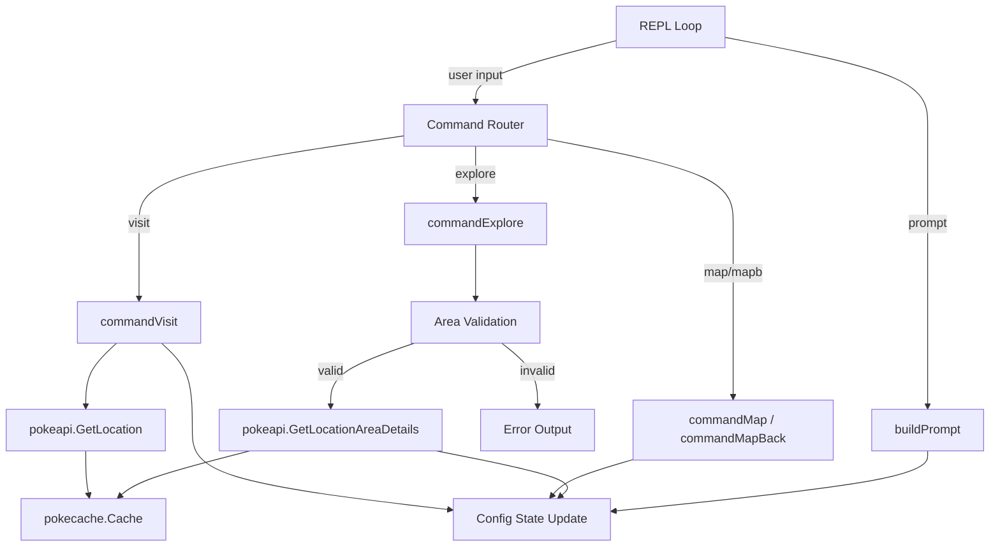

# Design Document: Location Movement System

## Overview

This feature introduces a Location abstraction layer above the existing LocationArea system in the Pokédex REPL. Users will "visit" a Location (city, route, etc.) via the PokeAPI `/location/<name>` endpoint, and the REPL will scope `map`/`mapb` and `explore` commands to the areas within that Location. The REPL prompt dynamically reflects navigation context using ANSI color codes.

The design builds on the existing architecture: a `Config` struct holds navigation state, command callbacks follow a standard signature, the `pokecache` provides TTL caching, and the `input.Terminal` interface abstracts I/O.

## Architecture



**Key architectural decisions:**

1. **Location data lives in Config** — The `CurrentLocation` field in Config stores the full parsed API response. This avoids re-fetching and keeps all navigation state in one place.
2. **Scoped pagination is local** — Instead of paginating via PokeAPI's `next`/`previous` URLs (which is how `map`/`mapb` work today for global areas), scoped pagination slices the in-memory `areas` list. This is simpler and eliminates extra HTTP calls.
3. **Prompt is computed per iteration** — A `buildPrompt` function generates the prompt string from Config state each loop iteration, keeping the REPL loop logic unchanged.
4. **Area validation before API call** — `explore` checks the area name against `CurrentLocation.Areas` before hitting the network, providing fast feedback and preventing invalid requests.

## Components and Interfaces

### New API Client Function

```go
// internal/pokeapi/pokeapi.go

type Location struct {
    ID     int    `json:"id"`
    Name   string `json:"name"`
    Areas  []struct {
        Name string `json:"name"`
        URL  string `json:"url"`
    } `json:"areas"`
    Region struct {
        Name string `json:"name"`
        URL  string `json:"url"`
    } `json:"region"`
    Names []struct {
        Name     string `json:"name"`
        Language struct {
            Name string `json:"name"`
            URL  string `json:"url"`
        } `json:"language"`
    } `json:"names"`
    GameIndices []struct {
        GameIndex  int `json:"game_index"`
        Generation struct {
            Name string `json:"name"`
            URL  string `json:"url"`
        } `json:"generation"`
    } `json:"game_indices"`
}

func GetLocation(locationName string, c *pokecache.Cache) (Location, error)
```

Follows the same pattern as `GetLocationAreaDetails`: constructs URL, checks cache, fetches, decodes, caches, returns.

### Updated Config Struct

```go
// main.go

type Config struct {
    Next            string
    Prev            string
    Pokedex         map[string]string
    commandCache    []string
    historyIndex    int
    // New fields
    CurrentLocation *pokeapi.Location  // nil when no location is visited
    CurrentArea     string             // "" when no area is explored
    ScopedPageIndex int                // pagination index for scoped map
}
```

### New Command: `commandVisit`

```go
func commandVisit(cfg *Config, args []string, t input.Terminal) error
```

- Validates args (requires exactly 1)
- Calls `pokeapi.GetLocation(args[0], cache)`
- On success: sets `cfg.CurrentLocation`, clears `cfg.CurrentArea`, resets `cfg.ScopedPageIndex` to 0
- On failure: prints error, leaves Config unchanged
- On success: displays location name, region, and area count

### Modified Commands: `commandMap` / `commandMapBack`

The existing `map`/`mapb` behavior changes:
- **If `CurrentLocation` is set**: paginate `CurrentLocation.Areas` in pages of 20
- **If `CurrentLocation` is nil**: display error instructing user to visit a location first

### Modified Command: `commandExplore`

- **If `CurrentLocation` is nil**: display error
- **If area name is not in `CurrentLocation.Areas`**: display error, no API call
- **Otherwise**: call `GetLocationAreaDetails`, display encounters, set `cfg.CurrentArea`

### Prompt Builder

```go
func buildPrompt(cfg *Config) string
```

- If `CurrentLocation == nil`: returns `"Pokedex > "`
- If `CurrentLocation != nil && CurrentArea == ""`: returns `Cyan + "[Location: " + truncate(name) + "] " + Reset + "Pokedex > "`
- If both set: returns `Cyan + "[Location: " + truncate(locName) + " | Area: " + truncate(areaName) + "] " + Reset + "Pokedex > "`

### Truncation Helper

```go
func truncateName(name string, maxLen int) string
```

- If `len(name) > maxLen`: returns `name[:maxLen-3] + "..."`
- Otherwise: returns `name` unchanged

The `maxLen` used in the prompt is 30.

## Data Models

### Location (API Response)

| Field         | Type                          | Description                          |
|---------------|-------------------------------|--------------------------------------|
| `id`          | `int`                         | PokeAPI Location ID                  |
| `name`        | `string`                      | Location identifier (e.g., "canalave-city") |
| `areas`       | `[]struct{Name, URL string}`  | Sub-areas within this location       |
| `region`      | `struct{Name, URL string}`    | Region this location belongs to      |
| `names`       | `[]struct{...}`               | Localized names                      |
| `game_indices`| `[]struct{...}`               | Game index references                |

### Navigation State (in Config)

| Field              | Type                | Default | Description                               |
|--------------------|---------------------|---------|-------------------------------------------|
| `CurrentLocation`  | `*pokeapi.Location` | `nil`   | Currently visited location                |
| `CurrentArea`      | `string`            | `""`    | Currently active area name                |
| `ScopedPageIndex`  | `int`               | `0`     | Current page in scoped map pagination     |

### Pagination Constants

| Constant        | Value | Description                        |
|-----------------|-------|------------------------------------|
| `PageSize`      | 20    | Items per page in scoped map       |
| `MaxNameLen`    | 30    | Max display length before truncation |

## Correctness Properties

*A property is a characteristic or behavior that should hold true across all valid executions of a system — essentially, a formal statement about what the system should do. Properties serve as the bridge between human-readable specifications and machine-verifiable correctness guarantees.*

### Property 1: Visit State Transition

*For any* valid Location API response, after a successful visit, `Config.CurrentLocation` SHALL equal the new location data, `Config.CurrentArea` SHALL be empty, and `Config.ScopedPageIndex` SHALL be 0.

**Validates: Requirements 1.1, 1.5, 2.8**

### Property 2: Visit Output Contains Required Information

*For any* Location with a name, region name, and areas list, the visit success output SHALL contain all three: the location name, the region name, and the correct area count (len of areas).

**Validates: Requirements 1.2**

### Property 3: Failed Visit Preserves State

*For any* initial Config state (with or without a current location and area), if the visit API call fails, Config.CurrentLocation, Config.CurrentArea, and Config.ScopedPageIndex SHALL remain unchanged.

**Validates: Requirements 1.3**

### Property 4: Pagination Correctness

*For any* Location with an areas list of length N and any valid page index P, `map` SHALL return items from index `P*20` to `min((P+1)*20, N)`, and `mapb` from index `(P-1)*20` to `P*20`, and the returned slice SHALL never exceed 20 elements.

**Validates: Requirements 2.1, 2.2, 2.6**

### Property 5: Area Validation Rejects Invalid Areas

*For any* Location and any area name string that does NOT appear in the Location's areas list, `explore` SHALL return an error and SHALL NOT invoke the location-area API.

**Validates: Requirements 3.2**

### Property 6: Successful Explore Updates Active Area

*For any* Location with a non-empty areas list and any area name that IS in the list, after a successful API fetch, `Config.CurrentArea` SHALL equal that area name.

**Validates: Requirements 3.1, 3.4**

### Property 7: Failed Explore Preserves State

*For any* initial Config state, if the location-area API call fails after area validation passes, `Config.CurrentArea` SHALL remain unchanged from its value before the explore call.

**Validates: Requirements 3.5**

### Property 8: Prompt Building

*For any* Config state, `buildPrompt` SHALL produce: the default prompt when `CurrentLocation` is nil; a location-only prompt when `CurrentLocation` is set and `CurrentArea` is empty; a location+area prompt when both are set. The prompt SHALL always end with `"Pokedex > "`.

**Validates: Requirements 4.1, 4.2, 4.3**

### Property 9: Name Truncation

*For any* string of length > 30, `truncateName(s, 30)` SHALL return a string of exactly 30 characters ending with `"..."`. *For any* string of length ≤ 30, `truncateName(s, 30)` SHALL return the original string unchanged.

**Validates: Requirements 4.6**

## Error Handling

| Scenario                                | Error Message                                              | Config Impact   |
|-----------------------------------------|------------------------------------------------------------|-----------------|
| `visit` with no args                    | "You must provide a location name to visit"                | None            |
| `visit` API returns non-200/error       | "Location '<name>' not found"                              | None            |
| `map`/`mapb` with no location set       | "No location set. Use 'visit <name>' to visit a location first" | None     |
| `map` already on last page              | "You're on the last page!"                                 | None            |
| `mapb` already on first page            | "You're on the first page!"                                | None            |
| `map`/`mapb` with empty areas list      | "This location has no areas"                               | None            |
| `explore` with no location set          | "No location set. Use 'visit <name>' to visit a location first" | None     |
| `explore` with invalid area name        | "Area '<name>' is not part of <location>. Use 'map' to see available areas" | None |
| `explore` API failure                   | "Error fetching area details: <error>"                     | None            |

All error scenarios follow the principle: display a helpful message and leave Config state unchanged.

## Testing Strategy

### Unit Tests (example-based)

- `visit` with no args returns error message (Req 1.4)
- `map`/`mapb` with nil location returns error (Req 2.5)
- `explore` with nil location returns error (Req 3.3)
- Default prompt when no location is set (Req 4.3)
- `help` output includes the `visit` command (Req 6.2)
- CommandRegistry contains `visit` entry with correct fields (Req 6.1)

### Property-Based Tests

Property-based testing is appropriate for this feature because the core logic (pagination, state transitions, prompt building, validation, truncation) involves pure functions with clear input/output behavior and a large input space.

**Library**: [rapid](https://github.com/flyingmutant/rapid) — a Go property-based testing library compatible with `testing.T`.

**Configuration**:
- Minimum 100 iterations per property test
- Each test tagged with: `Feature: location-movement-system, Property {N}: {title}`

**Properties to implement**:

| Property | Test Function                        | Key Generators                                    |
|----------|--------------------------------------|---------------------------------------------------|
| 1        | `TestProperty_VisitStateTransition`  | Random Location structs with varying area counts  |
| 2        | `TestProperty_VisitOutputFormat`     | Random location name, region, area list           |
| 3        | `TestProperty_FailedVisitPreservesState` | Random initial Config + simulated errors      |
| 4        | `TestProperty_PaginationCorrectness` | Random area lists (0-100 items), random page index |
| 5        | `TestProperty_AreaValidationRejects` | Random Location + random strings not in areas     |
| 6        | `TestProperty_ExploreUpdatesArea`    | Random Location + valid area selection            |
| 7        | `TestProperty_FailedExplorePreservesState` | Random Config + simulated API failure       |
| 8        | `TestProperty_PromptBuilding`        | Random location/area name combinations            |
| 9        | `TestProperty_NameTruncation`        | Random strings of varying lengths                 |

### Integration Tests

- End-to-end visit → map → explore flow with a mock HTTP server
- Cache hit verification: visit same location twice, verify only one HTTP request
- Prompt updates correctly across multiple commands in sequence
