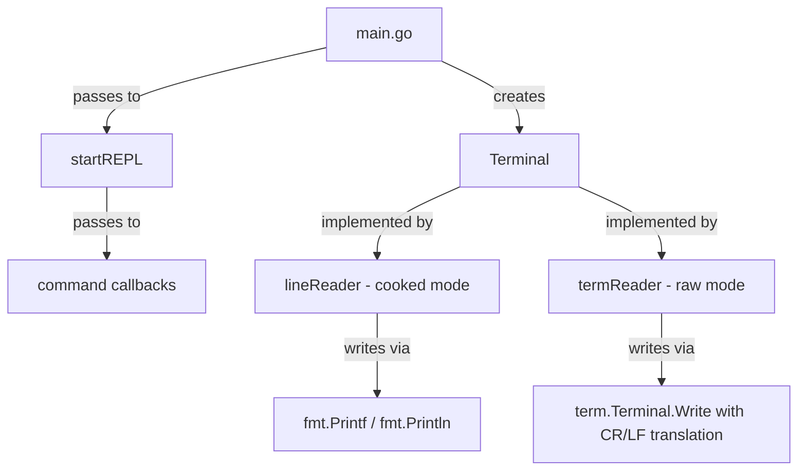

# Design Document: Terminal I/O Refactor

## Overview

This design refactors the Pokedex CLI's I/O layer so that all terminal output flows through a unified `Terminal` interface, alongside the existing input methods. Today, the `LineReader` interface in `internal/input/input.go` already carries `ReadLine`, `Print`, `Println`, `Close`, and `SetHistory` — but the REPL (`repl.go`) and every command callback (`main.go`) bypass it and call `fmt.Println`/`fmt.Printf` directly. In raw terminal mode this produces garbled output because bare `\n` is not rendered as a carriage-return + line-feed.

The refactoring:

1. Renames the existing `LineReader` interface to `Terminal` (same method set, new name).
2. Adds `\n` → `\r\n` translation inside `termReader.Print` and `termReader.Println`.
3. Changes `NewTerminalReader()` to return the `Terminal` interface instead of `*termReader`.
4. Threads the `Terminal` value into the REPL loop and every command callback, replacing all direct `fmt` output calls.

The goal is minimal diff — no new files, no new packages, no architectural changes beyond the rename and the plumbing.

## Architecture

The current architecture already has the right shape. The only structural change is renaming the interface and widening the callback signature.



### What changes

| Layer | Before | After |
|---|---|---|
| Interface name | `LineReader` | `Terminal` |
| `NewTerminalReader` return type | `*termReader` | `Terminal` |
| `termReader.Print` / `Println` | Write bytes verbatim | Replace `\n` → `\r\n` before writing |
| `startREPL` output | `fmt.Printf` / `fmt.Println` | `reader.Print` / `reader.Println` |
| Callback signature | `func(cfg *Config, args []string) error` | `func(cfg *Config, args []string, t input.Terminal) error` |
| Callback output | `fmt.Printf` / `fmt.Println` | `t.Print` / `t.Println` |

### What stays the same

- Package layout (`internal/input`, `main` package)
- `lineReader` implementation (delegates to `fmt` — no translation needed in cooked mode)
- `termReader.ReadLine` logic (already writes `\r\n` on Enter)
- `Config` struct, `CommandRegistry`, `cleanInput`, cache, API client

## Components and Interfaces

### Terminal Interface (renamed from LineReader)

Located in `internal/input/input.go`:

```go
// Terminal abstracts all terminal I/O (input + output).
type Terminal interface {
    ReadLine(prompt string) (string, error)
    Print(format string, args ...any)
    Println(args ...any)
    Close() error
    SetHistory([]string)
}
```

No method signatures change — only the interface name.

### lineReader (cooked mode)

No behavioral changes. `Print` delegates to `fmt.Printf`, `Println` delegates to `fmt.Println`. These already produce correct output in cooked mode.

### termReader (raw mode)

`Print` and `Println` gain `\n` → `\r\n` translation:

```go
func (r *termReader) Print(format string, args ...any) {
    s := fmt.Sprintf(format, args...)
    s = strings.ReplaceAll(s, "\r\n", "\n")   // normalize first
    s = strings.ReplaceAll(s, "\n", "\r\n")   // then translate
    r.term.Write([]byte(s))
}

func (r *termReader) Println(args ...any) {
    s := fmt.Sprintln(args...)
    s = strings.ReplaceAll(s, "\r\n", "\n")
    s = strings.ReplaceAll(s, "\n", "\r\n")
    r.term.Write([]byte(s))
}
```

The normalize-then-translate pattern avoids double-translating strings that already contain `\r\n`.

### NewTerminalReader

```go
func NewTerminalReader() Terminal {
    // ... same body, return type changes from *termReader to Terminal
}
```

### Command callback signature

```go
type cliCommand struct {
    name        string
    description string
    callback    func(cfg *Config, args []string, t input.Terminal) error
}
```

### startREPL

```go
func startREPL(cfg *Config, reader input.Terminal) {
    // ... uses reader.Print / reader.Println instead of fmt calls
}
```

## Data Models

No data model changes. `Config`, `cliCommand`, `CommandRegistry`, and all PokeAPI response types remain unchanged. The only structural change is the addition of the `input.Terminal` parameter to the callback function type.


## Correctness Properties

*A property is a characteristic or behavior that should hold true across all valid executions of a system — essentially, a formal statement about what the system should do. Properties serve as the bridge between human-readable specifications and machine-verifiable correctness guarantees.*

Most acceptance criteria in this feature are structural (interface definitions, compile-time checks) or integration-level (command callbacks calling the right methods). The one area with meaningful pure-function behavior suitable for property-based testing is the `\n` → `\r\n` newline translation in `termReader`.

### Property Reflection

From the prework, two criteria were classified as PROPERTY:
- 3.2: `Print` translates bare `\n` → `\r\n`
- 3.3: `Println` translates bare `\n` → `\r\n` and appends `\r\n`

Both test the same underlying translation function. Rather than testing each method separately, we extract the translation logic into a testable function and verify two properties:

1. **No bare `\n` in output** — the core correctness guarantee.
2. **Idempotence** — translating an already-translated string should not change it (no `\r\r\n` double-translation).

These two properties together fully validate criteria 3.2 and 3.3.

### Property 1: Newline translation eliminates bare line feeds

*For any* arbitrary string, after applying the `\n` → `\r\n` translation, the result SHALL NOT contain any bare `\n` (i.e., every `\n` in the output must be immediately preceded by `\r`).

**Validates: Requirements 3.2, 3.3**

### Property 2: Newline translation is idempotent

*For any* arbitrary string, applying the `\n` → `\r\n` translation twice SHALL produce the same result as applying it once (no `\r\r\n` sequences).

**Validates: Requirements 3.2, 3.3**

## Error Handling

This refactoring does not introduce new error paths. Existing error handling remains unchanged:

| Scenario | Current Behavior | After Refactor |
|---|---|---|
| `ReadLine` returns error | REPL breaks out of loop | Same — no change |
| Command callback returns error | `fmt.Println(err)` | `reader.Println(err)` — same semantics, different output path |
| Unknown command | `fmt.Printf(...)` | `reader.Print(...)` — same semantics |
| `NewTerminalReader` fails `MakeRaw` | `panic(err)` | Same — no change (out of scope) |
| `Close` fails `term.Restore` | Error returned, currently ignored by `defer` | Same — no change |

No new error types, no new failure modes. The refactoring is purely about routing existing output through the Terminal interface.

## Testing Strategy

### Unit Tests (example-based)

These cover the structural and integration-level acceptance criteria:

1. **lineReader satisfies Terminal interface** — compile-time check via `var _ Terminal = &lineReader{}`.
2. **termReader satisfies Terminal interface** — compile-time check via `var _ Terminal = &termReader{}` (requires build tag or test helper since termReader needs a real fd).
3. **REPL calls Terminal.Print for unknown commands** — mock Terminal, feed unknown command, assert Print was called with expected format.
4. **REPL calls Terminal.Println for callback errors** — mock Terminal, register a callback that returns an error, assert Println was called.
5. **commandHelp uses Terminal.Print** — mock Terminal, call commandHelp, assert Print was called with help text.
6. **commandPokedex uses Terminal.Println/Print** — mock Terminal with populated Pokedex, verify output calls.
7. **No direct fmt calls** — `go vet` or grep-based check (can be a CI lint step rather than a Go test).

### Property-Based Tests

Using the `testing/quick` package from Go's standard library (or `pgregory.net/rapid` for richer generators).

Each property test runs a minimum of 100 iterations.

1. **Feature: terminal-io-refactor, Property 1: Newline translation eliminates bare line feeds**
   - Generate arbitrary strings (including strings with `\n`, `\r\n`, `\r`, and no newlines).
   - Apply the translation function.
   - Assert: no byte position `i` exists where `output[i] == '\n'` and (`i == 0` or `output[i-1] != '\r'`).

2. **Feature: terminal-io-refactor, Property 2: Newline translation is idempotent**
   - Generate arbitrary strings.
   - Apply the translation function once → `result1`.
   - Apply the translation function again → `result2`.
   - Assert: `result1 == result2`.

### Test Organization

- Property tests for the translation function go in `internal/input/input_test.go`.
- REPL/command integration tests go in `repl_test.go` (extending the existing test file).
- A mock `Terminal` implementation is defined in the test files for verifying method calls.

### What Is NOT Tested

- `termReader.ReadLine` byte-level behavior (requires real terminal fd — manual testing).
- `termReader.Close` / `term.Restore` (external library behavior).
- Visual correctness of output in actual terminal (manual QA).
